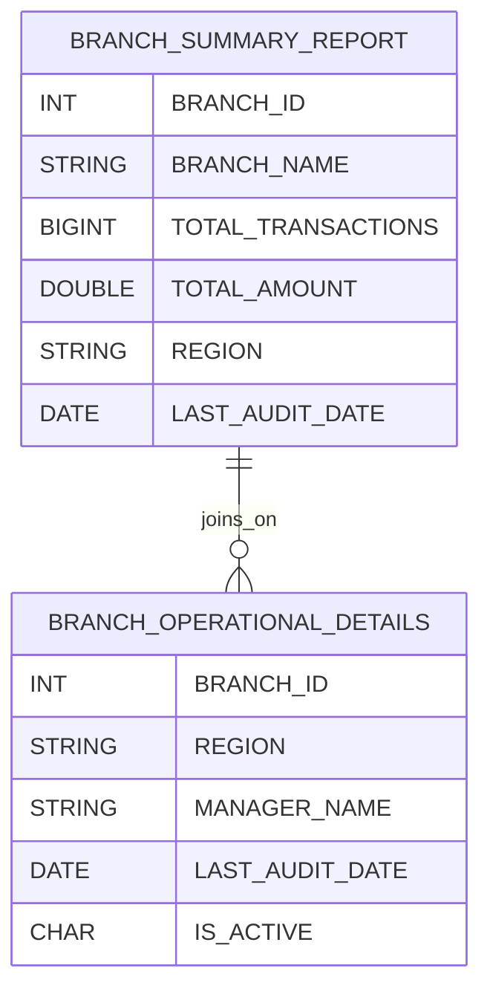

# =============================================
# Author: Ascendion AVA+
# Date: 
# Description: Technical specification for integrating BRANCH_OPERATIONAL_DETAILS into BRANCH_SUMMARY_REPORT in Snowflake ETL pipeline.
# =============================================

# Technical Specification for Branch Operational Details Enhancement

## Introduction
This document describes the technical specification for enhancing the Snowflake-based ETL pipeline to integrate the new source table `BRANCH_OPERATIONAL_DETAILS` into the `BRANCH_SUMMARY_REPORT`. The enhancement aims to improve compliance and audit readiness by including branch-level operational metadata (region, manager name, audit date, active status) in core reporting.

## Code Changes
### Impacted Areas
- **Snowflake Stored Procedure Logic**: Update to join the new source table and populate new columns.
- **Snowflake Table Structure**: Schema update to add new columns to the target table.
- **Data Validation & Reconciliation**: Update routines to account for new columns and data.

### Required Changes
- **Add Columns**: Add `REGION` and `LAST_AUDIT_DATE` columns to `BRANCH_SUMMARY_REPORT`.
- **Join Logic**: Enhance ETL logic to join `BRANCH_OPERATIONAL_DETAILS` on `BRANCH_ID`.
- **Conditional Population**: Populate `REGION` and `LAST_AUDIT_DATE` only where `IS_ACTIVE = 'Y'` in the source.
- **Backward Compatibility**: Ensure older records remain unaffected.

#### Pseudocode Example
```sql
ALTER TABLE BRANCH_SUMMARY_REPORT
  ADD COLUMN REGION STRING,
  ADD COLUMN LAST_AUDIT_DATE DATE;

-- In ETL Stored Procedure
UPDATE BRANCH_SUMMARY_REPORT BSR
SET
  REGION = BOD.REGION,
  LAST_AUDIT_DATE = BOD.LAST_AUDIT_DATE
FROM BRANCH_OPERATIONAL_DETAILS BOD
WHERE BSR.BRANCH_ID = BOD.BRANCH_ID
  AND BOD.IS_ACTIVE = 'Y';
```

## Data Model Updates
### Source Data Model
- **New Table**: `BRANCH_OPERATIONAL_DETAILS`
  - `BRANCH_ID INT PRIMARY KEY`
  - `REGION VARCHAR2(50)`
  - `MANAGER_NAME VARCHAR2(100)`
  - `LAST_AUDIT_DATE DATE`
  - `IS_ACTIVE CHAR(1)`

### Target Data Model
- **Existing Table**: `BRANCH_SUMMARY_REPORT`
  - **Before:**
    - `BRANCH_ID INT`
    - `BRANCH_NAME STRING`
    - `TOTAL_TRANSACTIONS BIGINT`
    - `TOTAL_AMOUNT DOUBLE`
  - **After (Additions in bold):**
    - `BRANCH_ID INT`
    - `BRANCH_NAME STRING`
    - `TOTAL_TRANSACTIONS BIGINT`
    - `TOTAL_AMOUNT DOUBLE`
    - **REGION STRING**
    - **LAST_AUDIT_DATE DATE**

#### Data Model Diagram


## Source-to-Target Mapping
| Source Table                | Source Column      | Target Table           | Target Column      | Transformation Rule                                |
|-----------------------------|--------------------|------------------------|-------------------|----------------------------------------------------|
| BRANCH_OPERATIONAL_DETAILS  | REGION             | BRANCH_SUMMARY_REPORT  | REGION            | Set if IS_ACTIVE = 'Y', else NULL                  |
| BRANCH_OPERATIONAL_DETAILS  | LAST_AUDIT_DATE    | BRANCH_SUMMARY_REPORT  | LAST_AUDIT_DATE   | Set if IS_ACTIVE = 'Y', else NULL                  |

## Assumptions and Constraints
- Only active branches (`IS_ACTIVE = 'Y'`) will have REGION and LAST_AUDIT_DATE populated.
- The enhancement must not affect historical data or non-impacted columns.
- Full reload of `BRANCH_SUMMARY_REPORT` required during deployment.
- Data governance and security standards must be maintained.
- Backward compatibility is required for legacy reports.

## References
- JIRA Story: Extend BRANCH_SUMMARY_REPORT Logic to Integrate New Source Table
- Confluence: ETL Change - Integration of BRANCH_OPERATIONAL_DETAILS
- Source DDL: `branch_operational_details.sql`
- Target DDL: `target_ddl.sql`

---

## Cost Estimation and Justification

- **Input Tokens:** [TO BE CALCULATED]
- **Output Tokens:** [TO BE CALCULATED]
- **Model Used:** [TO BE DETECTED]
- **Pricing:** [TO BE RETRIEVED]

**Formula:**
- Input Cost = input_tokens * input_cost_per_token
- Output Cost = output_tokens * output_cost_per_token

**Breakdown:**
- [Present actual numbers and calculation when available]
