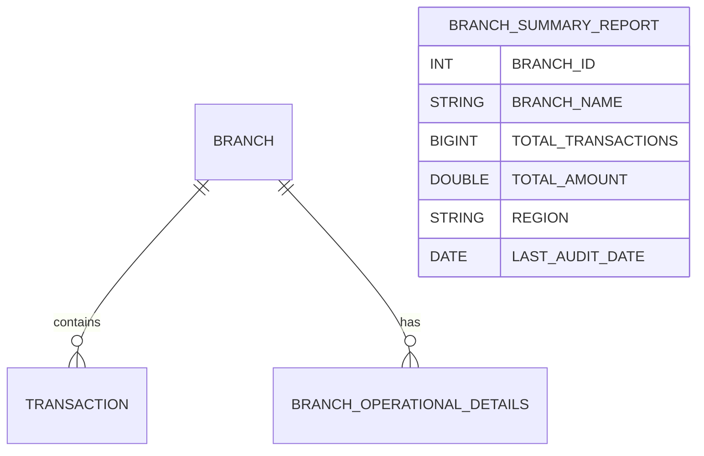

# =============================================
**Author:** Ascendion AVA+
**Date:** 
**Description:** Technical specification for integrating BRANCH_OPERATIONAL_DETAILS into BRANCH_SUMMARY_REPORT to enhance compliance and audit readiness.
# =============================================

# Technical Specification for Integration of BRANCH_OPERATIONAL_DETAILS into BRANCH_SUMMARY_REPORT

## Introduction
This document outlines the technical requirements and implementation plan for integrating the new Snowflake source table `BRANCH_OPERATIONAL_DETAILS` into the existing `BRANCH_SUMMARY_REPORT` ETL pipeline. The enhancement aims to improve compliance and audit readiness by including branch-level operational metadata (region, manager name, audit date, active status) in the reporting layer.

## Code Changes
### Impacted Areas
- **Snowflake Stored Procedure Logic:**
  - Update the stored procedure responsible for populating `BRANCH_SUMMARY_REPORT` to join with `BRANCH_OPERATIONAL_DETAILS` using `BRANCH_ID`.
  - Add logic to populate new columns (`REGION`, `LAST_AUDIT_DATE`) only when `IS_ACTIVE = 'Y'`.
  - Ensure backward compatibility for older records where operational details may not exist.
- **Data Validation and Reconciliation Routines:**
  - Update validation scripts to check for the presence and correctness of the new columns.

### Pseudocode Example
```sql
-- Pseudocode for ETL enhancement
INSERT INTO BRANCH_SUMMARY_REPORT (BRANCH_ID, BRANCH_NAME, TOTAL_TRANSACTIONS, TOTAL_AMOUNT, REGION, LAST_AUDIT_DATE)
SELECT b.BRANCH_ID, b.BRANCH_NAME, SUM(t.AMOUNT), COUNT(t.TRANSACTION_ID),
       bod.REGION, bod.LAST_AUDIT_DATE
FROM BRANCH b
LEFT JOIN TRANSACTION t ON b.BRANCH_ID = t.BRANCH_ID
LEFT JOIN BRANCH_OPERATIONAL_DETAILS bod ON b.BRANCH_ID = bod.BRANCH_ID AND bod.IS_ACTIVE = 'Y'
GROUP BY b.BRANCH_ID, b.BRANCH_NAME, bod.REGION, bod.LAST_AUDIT_DATE;
```

## Data Model Updates
### Source Data Model
- **New Table:** `BRANCH_OPERATIONAL_DETAILS`
  - Columns: `BRANCH_ID` (PK), `REGION`, `MANAGER_NAME`, `LAST_AUDIT_DATE`, `IS_ACTIVE`

### Target Data Model
- **Table:** `BRANCH_SUMMARY_REPORT`
  - **Before:**
    - `BRANCH_ID INT`
    - `BRANCH_NAME STRING`
    - `TOTAL_TRANSACTIONS BIGINT`
    - `TOTAL_AMOUNT DOUBLE`
  - **After (Add):**
    - `REGION STRING`
    - `LAST_AUDIT_DATE DATE`

#### Data Model Diagram


## Source-to-Target Mapping
| Source Table                | Source Column         | Target Table           | Target Column      | Transformation Rule                                 |
|-----------------------------|----------------------|------------------------|-------------------|-----------------------------------------------------|
| BRANCH_OPERATIONAL_DETAILS  | REGION               | BRANCH_SUMMARY_REPORT  | REGION            | If IS_ACTIVE = 'Y', else NULL                      |
| BRANCH_OPERATIONAL_DETAILS  | LAST_AUDIT_DATE      | BRANCH_SUMMARY_REPORT  | LAST_AUDIT_DATE   | If IS_ACTIVE = 'Y', else NULL                      |
| BRANCH                     | BRANCH_ID            | BRANCH_SUMMARY_REPORT  | BRANCH_ID         | Direct                                              |
| BRANCH                     | BRANCH_NAME          | BRANCH_SUMMARY_REPORT  | BRANCH_NAME       | Direct                                              |
| TRANSACTION                | AMOUNT               | BRANCH_SUMMARY_REPORT  | TOTAL_AMOUNT      | SUM(AMOUNT) grouped by BRANCH_ID                    |
| TRANSACTION                | TRANSACTION_ID       | BRANCH_SUMMARY_REPORT  | TOTAL_TRANSACTIONS| COUNT(TRANSACTION_ID) grouped by BRANCH_ID          |

## Assumptions and Constraints
- Only branches with `IS_ACTIVE = 'Y'` in `BRANCH_OPERATIONAL_DETAILS` will have `REGION` and `LAST_AUDIT_DATE` populated.
- Backward compatibility is maintained for records where operational details are missing.
- Full reload of `BRANCH_SUMMARY_REPORT` is required during deployment.
- Data governance and security standards must be followed throughout the process.

## References
- JIRA Story: Extend BRANCH_SUMMARY_REPORT Logic to Integrate New Source Table
- Confluence: ETL Change - Integration of BRANCH_OPERATIONAL_DETAILS into BRANCH_SUMMARY_REPORT
- DDLs: `branch_operational_details.sql`, `source_ddl.sql`, `target_ddl.sql`

---

# Cost Estimation and Justification

**Input Tokens:** [To be calculated]
**Output Tokens:** [To be calculated]
**Model Used:** [To be detected]

**Pricing (example):**
- Input: `[input_tokens] * [input_cost_per_token]`
- Output: `[output_tokens] * [output_cost_per_token]`

**Total Cost:** Input Cost + Output Cost

*Note: Replace placeholders with actual values as per environment/model used.*
